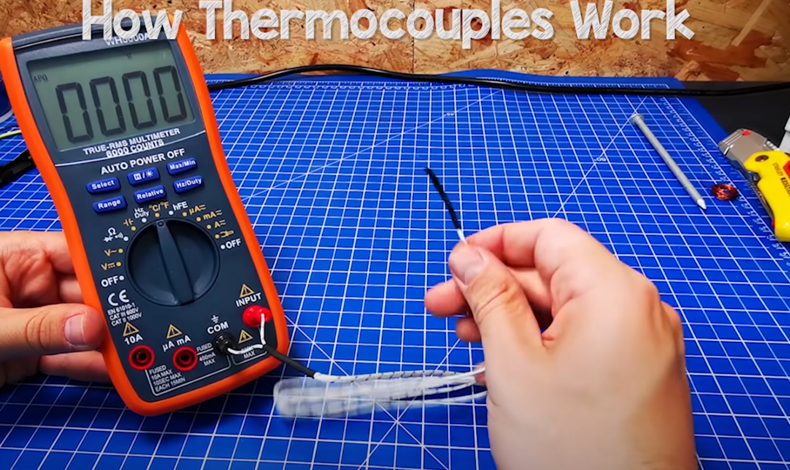
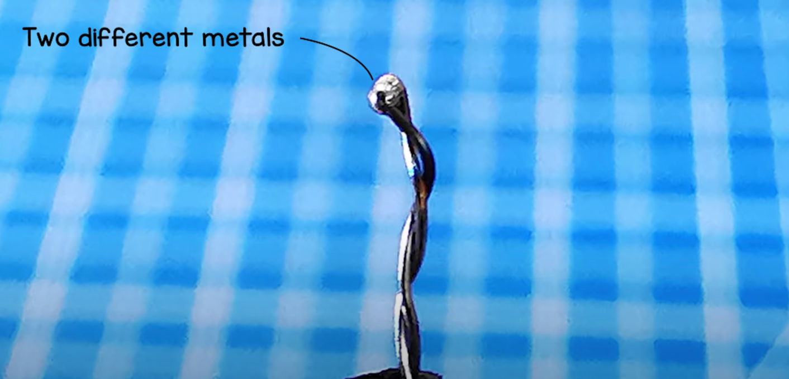
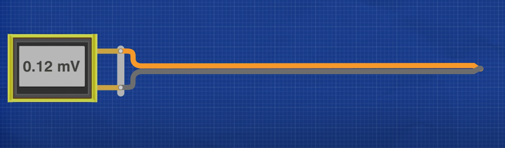
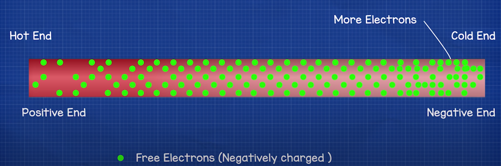

Nondispersive infrared (NDIR) sensor is often used to detect gas and measure the concentration of carbon dioxides.

For carbon monoxide, there are four common sensor types:  Opto-chemical, Biomimetic, Electrochemical, Semiconductor. [3] Some CO sensor also uses the NDIR technology.

1. Why is it called nondispersive infrared sensor?
There is an infrared light source and the light is not prefiltered by prism or diffraction gratings.

Light dispersion [1]

2. How does the detector side work?
Example in [2]:
Dual thermopiles with optical filters and thermistors.

real thermocouple example:
   

detail:
  

model:
  

What happens when one side of the metal is heated? (temperature gradient)
  

Reference 
[1]Wikipedia contributors. "Dispersion (optics)." Wikipedia, The Free Encyclopedia. Wikipedia, The Free Encyclopedia, 26 Oct. 2022. Web. 1 Nov. 2022.

[2] Lee, Robert, and Walt Kester. "Complete gas sensor circuit using nondispersive infrared (NDIR)." Anal. Dialog 50 (2016): 10-18.

[3] Wikipedia contributors. "Carbon monoxide detector." Wikipedia, The Free Encyclopedia. Wikipedia, The Free Encyclopedia, 14 Oct. 2022. Web. 1 Nov. 2022.

[4] https://www.youtube.com/watch?v=v7NUi88Lxi8&ab_channel=TheEngineeringMindset