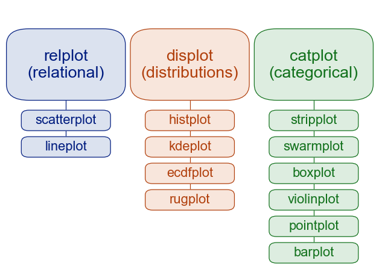

part1

浏览了一下seaborn的官网，发现了一些有趣的东西，决定仔细学一下这个库。
我觉得更有趣的并不是编程技巧，而是里面给出的很多范例，让我知道了更多的统计绘图例子。比如，seaborn官网有一个Gallery界面，里面有各种各样的数据分析图，很多是我不知道的，比如 Anscombe's quartet, Hexbin plot，stacked histogram，conditional means with observations，joint histograms/kde，overlapping densities，boxenplot，conditional kde，plooting model with residual，smooth kde，discovering structure in heatmap，trivariate histogram。

如何去理解和分类不同的图呢？seaborn把所有的图分成了三类：relational，distributions，categorical，分别对应到replot，displot，catplot三个方法。还有其他一些小方法的分类，如下图

  

我感觉distributions和categorical很容易混淆，之后要详细讨论一下。

有趣的还有一些背景知识，开发者Michael Waskom是个researcher，seaborn似乎是他的业余作品。seaborn的默认配色是蓝色，我估计这是为了符合seaborn这个名字。
