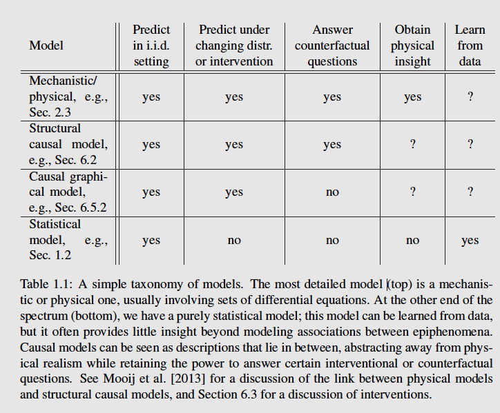

todo: Julea pearl

### ch1 Statistical and Causal Models
Probability theory and statistical learning: inverse problems
just like statistical learning, causal inference: empirical implications (data + interventions) -> causal structure 

**Reichenbach’s common cause principle**

Two examples: digit recognition and gene perturbation

Notion: structural causal models (SCMs) / structural equation models

Symbol: **:=**, the equality sign conveys the asymmetrical relation “is determined by”, more like an assignment symbol in programming languages than like an algebraic equality.

Physical models, SCM, statistical models:
  

### ch2 Assumptions for Causal Inference
Principle: **Independent mechanisms**:
The causal generative process of a system’s variables is composed of autonomous modules that do not inform or influence
each other. 
In the probabilistic case, this means that the conditional distribution of each variable given its causes (i.e., its mechanism) does not inform or influence the other conditional distributions. 
In case we have only two variables, this reduces to an independence between the cause distribution and the mechanism producing the effect distribution.

Three interpretations perspectives: physical mechnisms, information theorectic, noise

There are some insights mentioned in the historical notes and physical structure sections.

$\mathfrak{C}$
### ch3 Cause-Effect Models

