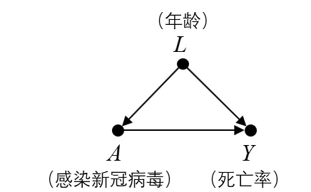
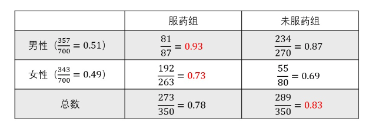

resoources: https://www.zhihu.com/people/wang-zhiyang/posts

### 介绍
深度学习的缺点：
例子，多余的特征会误导算法给出的策略：包含刹车指示灯的训练集数据让算法误以为刹车灯亮起时应该踩刹车（左），而不是在有阻挡物的时候踩刹车。
我的例子：用png和jpg数据区分pokeman和Digimon
“因果关系之梯”：关联，干预和反事实，巧克力和诺贝尔奖的例子

### 贝叶斯网络
问题：很难通过数据学习到贝叶斯网络的结构
原因：贝叶斯网络没有涉及到因果性，只是表达了（条件）概率分布

### 混杂
confounding混杂：
  
因果推理的一大目标就是尽量消除混杂带来的偏倚（也就是那些非因果的关联关系），找出真正的因果关系。
d-separation: how to judge conditional dependence
backdoor criterion后门准则：如何消除混杂
后门准则：如果我们有足够的数据能够将所有C和E之间的后门路径全部阻断，那么我们就可以识别（identify）C和E之间的因果关系。
混杂因子的概念是建立在因果图结构之上的，必须要指定因果图的结构，混杂因子才有意义。

先判断是否存在混杂，再判断混杂因子
1. 如果有未被阻断的后门路径就存在混杂，默认变量是未被观测到的。
2. 如何判断混杂因子：
    1. 【从结构角度定义】如果以某个变量 L为条件使得变量 C 和 E 之间的相关性发生了更改（即原来相关变为不相关、原来不相关变为相关），那么该变量 L 为C 和 E 之间的混杂因子。【
    2. 从传统角度定义】当变量 L 满足以下三个条件时，L便是C 和 E之间的混杂因子：L 与 C 相关当以 C 为条件时 L 与 E 相关L 不在 C 到 E 的因果关系路径中

例子

### 干预
SCM：变量集和函数集，对应到图模型
干预和条件概率的区别：因此，以变量为条件改变的是我们看世界的角度，而干预则改变了世界本身。
具体干预如何实现：
在图模型中，干预的操作将删除所有指向该变量的边。
例子：辛普森悖论
  
例子的问题在于男女不均衡，0.78靠近0.73，0.83靠近0.87