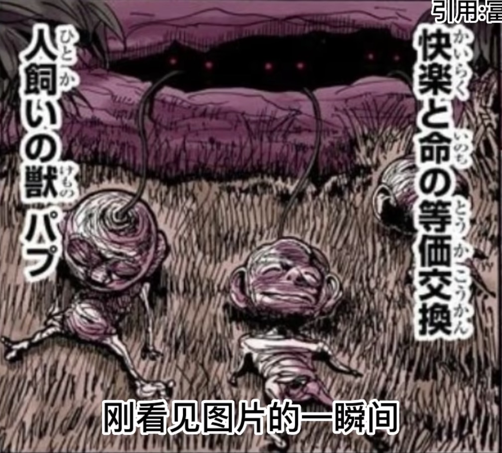
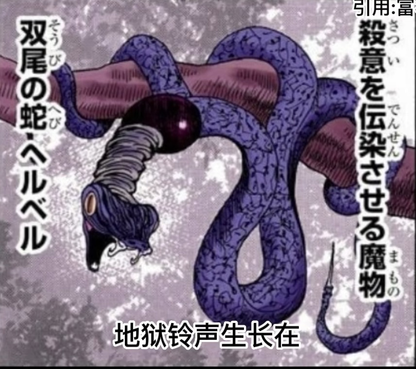

## 猎人
### 绘画
1. 人物特写的背景是特别设计的，比如350.4 酷拉皮卡背景是锁链
2. 环境背景经常被涂灰 350.5， 350.12
3. 纯黑背景经常有一些奇怪的图案 350.7
4. 酷拉皮卡的思考背景：细密的网络 350.8
5. （非常常见）页面的主要人物会跨越几个网格 350.10
6. 黑白对比与平衡 350.11 350.19 362.4 366.19
7. （非常常见）全身图和特写放一起 350.11 355.10
8. 对角线构图：天空竞技场 351.1
9. 战斗视角切换 351.13: 侧面-背面-正面，同时挡住左手的动作 355.19 第二视角，上帝视角，侧面第三视角
10. 视角切换 366.15
11. 速度线和战斗动作配合 353.19
12. 思考背景通常是纯黑的：359.12
13. 一段对话或者思考结束时会转到环境代表结束 362.5
14. 站斗的速度和张力 355.10
15. 人物的微表情 366.14

### 编剧
1. 分析与反分析， 350.12 酷拉皮卡通过招聘的词分析出雇主，但雇主另有他人，是故意想招有这种分析能力的人

### 思考
1. 为什么比杨德能掀起波澜，让V5和他们合伙。
   1. 因为他们通过媒体广播煽动了很多人，这导致V5如果要处理掉他们需要耗费很多财力人力。这体现出政体控制媒体的重要性。
2. 字太多：358.13， 358.14
3. 普通人上船肯定要为王位争夺战牺牲的，不然没有必要拉上大众（362.5）
4. 莫比乌斯湖的设定：某些未知之间可以超越地理位置的设定达到互通，所以也许乘船不是前往暗黑大陆唯一的方法，小杰和奇之后可能通过这种设定来到黑暗大陆
#### 五大灾难
植物兵器 金银锭：
雾状生物 埃：阿路嘉/拿尼嘉（埃），”欲望“依存体，没有实体存在，只能寄生在拥有实体的生物上，拧成绳子的人类尸体。埃可能是由会长黑暗大陆三人行中的杰格揍敌客zigg zoldyck带回的。
育人兽 帕普：
  
洞穴里控制外面干枯生物的红眼睛才是帕普。可能和小杰之前的变强有关，但我觉得这一点正反方证据都有。
正方：制约与誓约只是一种推测，而且除念师处理不了这种情况，最终被和黑暗大陆有关的阿路嘉解决了，这符合来自黑暗大陆的灾难要从黑暗大陆得到解决。帕普守护的是电石，这和奇直接相关，所以后续小杰和奇可能直接进入这一条主线。另一条线索是小杰能和帕普沾边是因为其祖先东富力士去过黑暗大陆。
反方：帕普的能力是快乐和生命的等价交换，画面中干枯的人偶也都表情快乐，但是小杰像是能力和生命的等价交换，而且也没有联通帕普和人偶头部的管道出现，不过这一点可以通过一些设定解决（比如念兽）。
双尾蛇 地狱铃声：
  
舌头下面的绳子和圆球是什么？
能够传染杀意的魔物
守护长生不老的食物 尼托洛米，这可能和会长黑暗大陆三人行中会长和猎人协会最年长的美食猎人又关，他们是到黑暗大陆之后才能如此长寿的。至于杰格揍敌客，漫画其他处未有提及。
地狱铃声可能和旋律以前听过的暗之奏鸣曲有关。旋律的身体收到了极大的摧残，但是因此获得念能力，塔想要找到并销毁暗之奏鸣曲的乐谱，所以她会进入地狱铃声的支线。
有人说“能够传染杀意”可能和西索有关，我觉得很牵强，倒是西索可能本身不会被这种能力所影响，因为他的杀意本来就很强。

