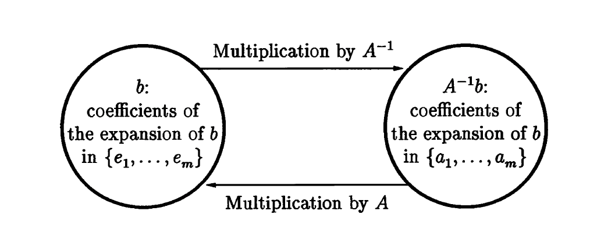

## Part I Fundamentals

### Matrix

New terms: range (row space), adjoint/hermitian conjugate $A^*$, hermitian matrix, unitary matrices,

Matrix inverse times a vector interpretation:
$A^{-1}b$ is the unique vector of coefficients of the expansion of $b$ in the basis of columns of $A$.
Or in short, change of basis:

How to prove row rank and column rank are the same? SVD, both equal to the rank of $\Sigma$.

The multiplication of a unitary matrix preserves the inner product, so it preserves the 2-norm. In the case of real matrix, it could be understood as rotation ($det Q = 1$)/reflection operation ($det Q = -1$).

For the matrix norm, it also preserves the 2-norm and Frobenius norm. For the 2-norm, it is because rotation does not impact how the matrix will stretch the vector. For the Frobenius norm, it can be proved by just summing up $\|QA_i\|$, which is the preserved vector 2-norm.
$$\|QA\|_2 = \|A\|_2, \|QA\|_F = \|A\|_F$$
(Theorem 3.1)

### Norms

"The Sergei plaza in Stockholm, Sweden has the shape of the unit ball in the 4-norm."

Notation difference: subscripts with parenthesis are matrix dimension notation, otherwise it is the norm notation.
There are two ways to define matrix norm:

1. Induced matrix norms. Define as the maximum factor by which $A$ can "stretch" a vector $x$.

$$\|A\|_{(m,n)} = \sup _{x\in \mathbf{C}^n, x \neq 0} \frac{\|Ax\|_{(m)}}{\|x\|_{(n)}} = \sup _{x\in \mathbf{C}^n, \|x\|_{(n)}=1} \|Ax\|_{(m)}$$

These norms are named as p-Norm.

1. 1-Norm of a matrix is equal to the "maximum column sum" of $A$.
2. The $\infty$-Norm of a matrix is equal to the "maximum row sum" of $A$.
3. The 2-Norm of a matrix is equal to the largest singular value.

4. General matrix norm, do not have to be induced by vector norms, just needs to satisfy the three properties of norm.
   Eg: The Frobenius norm $\|A\|_F$ is not induced by a vector norm. Note: It is different from $\|A\|_2$, but in different places notations are different.

Property:
$$\|A\|_F = \sqrt{tr(A^*A)} = \sqrt{tr(AA^*)}$$

Both the induced matrix norm and the Frobenius norm are sub-multiplicative. (3.14) and (3.18) below. But the induced matrix norm can not make should the equality holds.

### SVD

The idea to introduce SVD will lead to the reduced SVD:
$$Av_j = \sigma_ju_j, 1\leq j \leq n$$
(If $A$ is full rank)
Together with the linear transformation idea that "**The image of the unit sphere under any $m\times n$ matrix is a hyperellipse**", we can select a set of orthonormal vectors $v_j$ to get the streched orthonormal vectors $u_j$.

The unite sphere transformed to hyperellipse idea can be verified by the SVD itself:
$$A = U\Sigma V^*$$
First $V$, then $\Sigma$, $U$...

change of basis understanding of SVD

SVD vs eigenvalue decomposition: p33

SVD provides the low rank Approximation of a matrix that captures as much as the energy of the matrix as possible.

Application of SVD: determing the rank, finding accurate orthonormal basis, calculating norm, and other problems.

## Part III Conditioning and Stability

### lecture 12

absolute or relative?

difference in conditioning and stability? operational-wise?

eg 12.3?

Feynman Lucky numbers?

Polynomial root finding ill-condition?

superimposed roots?

$$\kappa = \|A\|\frac{\|x\|}{\|Ax\|} \leq \|A\|\|A^+\|$$
When are they equal?
when $x$ is multiple of the singular vector corresponding to the minmimum singular value.

Fact: $\|A\|_2 = \sigma_{max}, \|A^+\|_2 = \frac{1}{\sigma_{min}}$

foundemental things: theorem 12.1 and 12.2
The conclusion in the last paragraph!

### lecture 13

The 2x-1 problem?

determinant overflow?
