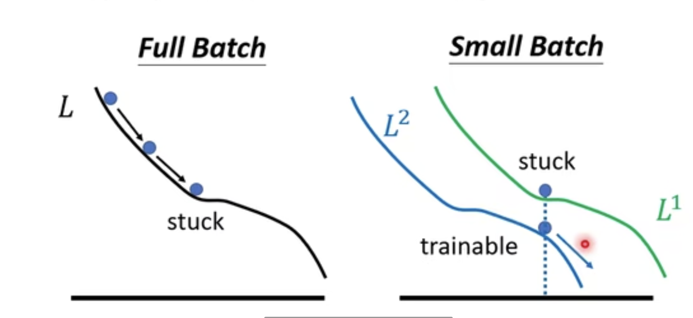

## Lecture 2 Topic modelling with NMF and SVD

scikit-learn: based on numpy and scipy
motivation: great try on how to interprete the matrix decomposition (in fact this is better for NMF then SVD).

"""
Consider the most extreme case - reconstructing the matrix using an outer product of two vectors. Clearly, in most cases we won't be able to reconstruct the matrix exactly. But if we had one vector with the relative frequency of each vocabulary word out of the total word count, and one with the average number of words per document, then that outer product would be as close as we can get.

Now consider increasing that matrices to two columns and two rows. The optimal decomposition would now be to cluster the documents into two groups, each of which has as different a distribution of words as possible to each other, but as similar as possible amongst the documents in the cluster. We will call those two groups "topics". And we would cluster the words into two groups, based on those which most frequently appear in each of the topics. 
"""

preprocessing in nlp: TF-IDF 

show_topics functions: top_words: for a row of vh (one topic), find the words corresponing the largest values

Thought on what does it mean if a value is negative/positive in vh.
Since the rows are orthogonal to each other, so for any two rows, if you make a dot product, sometimes the negative values and positive values should be multiplied together to get a negative product so that the product sum adds up to zero. If you believe the larger positive values correspond to the words that characterize the topic, then the smaller negative corresponds to the words that cannot characterize the topic. I think it also works vise versa.
But which interpretation is better for the real input?

NMF avoids this problem.

GD: in the video, it shows a way to make animation of GD in python to show how the curve fitting changes along the GD optimization, which is good for teaching.

Why do we use SGD?
Faster? no, GD can better make use of parallelization, larger mini-batch size actually takes shorter to go through the training set.
In fact, the reason is SGD's accuracy is better. Why?
Noisy updates make every loss different, so it might not get stuck.
  

Another point: smaller batch-size works better on test sets:
  
Why?
one possible explanation:
  

np.where(condition, x, y):
Returns an array with elements from x where condition is True, and elements from y elsewhere.
`
a = np.arange(10)
p.where(a < 5, a, 10*a)
array([ 0,  1,  2,  3,  4, 50, 60, 70, 80, 90])
`
np.min(a, b) or np.minimize(a, b) broadcasting mechnism

pytorch: torch, lua

pytorch supports m1, m2, m1pro now, 

difference between reduced SVD and truncated SVD:
reduced <-> full, remove zero blocks in S and remove useless columns in U
truncated: choose smaller number of singular values

## lecture 3 New perspectives on NMF and randomized SVD

SVD: the columns of U and rows of Vh are topic vectors
(document, word) = (document, topic)(topic, topic)(topic, word)
SVD is not unique! S is, but eg you can use (-U) and (0Uh)

NMF:
(document, word) = (document, topic)(topic, word)

## lecture 8 how to implement least squares
My confusion: why does an equation thas has no solution becomes to be solvable?
The rules of matrix equations and algebra equations are different. For algebra equations, you can multiply each side by a non-negative term and the solution remains the original one. For a matrix equation, when you multiply a matrix on each side, the unsolvable equation may become solvable. Eg, Ax=b, BAx = Bb, B does a linear transformation to A, which changes the space that A spans and the equation may be solvable.

For normal equations, QR, SVD methods that solve the least squares problem, there is always one step to multiply each side one matrix which makes the original problem a new solvable one.

Next problem is that do they lead to the minimum least square? 
One key thing is that if B is orthogonal, the multiplication operation keeps the Eucleadian norm.