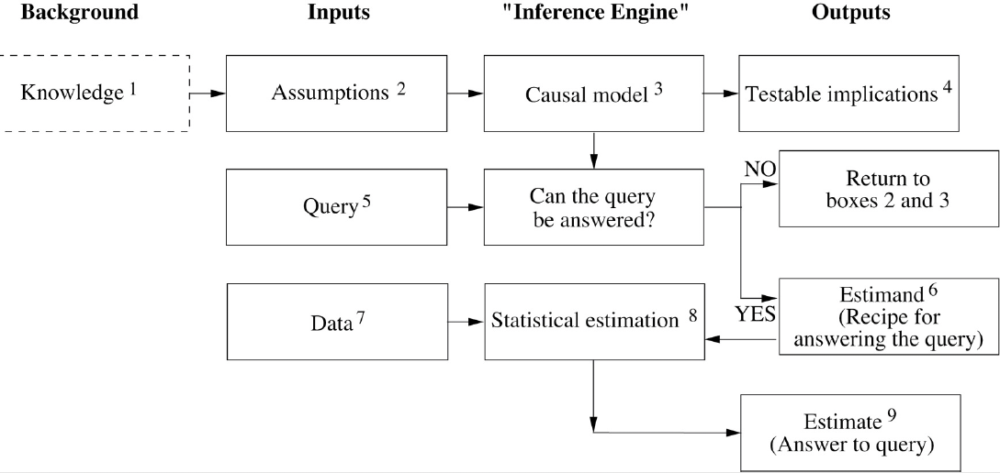

Introduction: mind over data

Problems: "preventing", "cause", "attribute to", "policy", "should I" ...

-> "new science", causal inference

Why wasn't this done a long time ago?
1. The mathematical structure does not show causality. $B=kP$
2. Human brains are good at handling causations so there wes not enough need to mathematically do that.
3. Historical reasons, a subject needs incentives. - Sewall Wright did some work in 1920s, but underappreciated.

"Causal revolution"

What is it:
Causal digram and symbolic language (resembling algebra)

details:
do operator $P(L \mid do(D))$, $P(L \mid do(not-D))$, different with $P(L \mid D)$

prediction: predict the effects of an intervention withou4 actually enacting it

counterfactual

### What is causal inference?
Causal digram (bayesian network in ch3) and symbolic language (resembling algebra) (ch9 mediation?)

### What is not causal inference?
Difference between $P(L \mid D) and  $P(L \mid do(D))$.

#### Difference between classical statistics and causal inference
1. In the inference engine, the query part (5) and the estimation part coincide (8). 
2. Data collection is arranged after we posit the causal model.

### What is its substitute?
No except Sewall Wright's work in 1920s (ch2)

### Why is it important?
1. The lack of causation in the math framework and science history (ch2, ch5).
2. The ladder of Causation (ch1).
3. Counterfactuals (ch8). 

### How to do causal inference?
Randomized controlled trial (RCT) (ch4)

inference engine (ch7 - ch9)
  

query: should be formulated in causal vocabulary, eg, what is $P(L | do(D))$?
#### The assumption 

### Different types of causal inference
